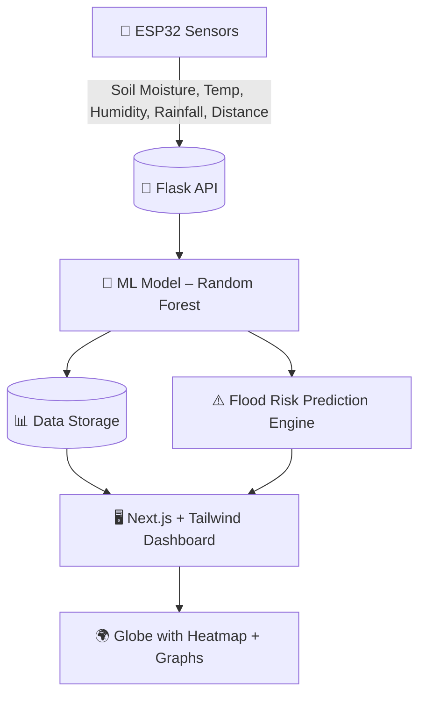

<div align="center">

# 🌊 DripTect  
### *Smart Flood Detection & Prediction System*  

🚀 An IoT + AI powered platform for **real-time flood monitoring, weather visualization, and predictive risk analysis**. 


<!------>

</div>

---

## 📖 Overview  

**DripTect** integrates **ESP32 IoT sensors**, a **Flask + Machine Learning backend**, and a **Next.js dashboard** to predict and visualize flood risk.  
It empowers communities with **real-time data**, **historical insights**, and **early alerts** to build climate resilience.  

---

## 🏗️ System Architecture  



---

## ✨ Features  

- 🌱 **IoT Sensor Network** → Soil moisture, humidity, temperature, rainfall, water level  
- ⚡ **Real-time Data Processing** → ESP32 → Flask → ML model  
- 🤖 **Machine Learning** → Random Forest predicts **flood risk severity**  
- 🖥️ **Interactive Dashboard** → Next.js + Tailwind + Shadcn UI  
- 🌍 **3D Rotating Globe Heatmap** → Weather across India (OpenWeather API)  
- 📊 **Historical Trends** → Graphs for past **24h & 7d**  
- ⚠️ **Risk Analysis** → "View Risk" button shows flood probability  

---

## ⚙️ Tech Stack  

**Hardware** → ESP32, DHT11, Soil Moisture, Rain Sensor, Ultrasonic  
**Backend** → Flask + Python (Random Forest ML Model)  
**Frontend** → Next.js, TailwindCSS, Shadcn UI, Recharts, Framer Motion  
**API** → OpenWeather API  
**Database** → Pandas (logs), PostgreSQL (scalable option)  

---

## 📊 Workflow  

1. **ESP32 Sensors** collect environmental data.  
2. **Flask Backend** stores & forwards to ML model.  
3. **ML Model** predicts flood risk levels.  
4. **Next.js Dashboard** displays:  
   - 🌍 Rotating globe with heatmap  
   - 📊 Weather + API insights  
   - ⏳ Historical 24h & 7d graphs  
   - ⚠️ Flood Risk prediction card  

---


<!--## 🖼️ UI Preview (Mockups)  

| Landing Page | Prediction Dashboard |
|--------------|----------------------|
|  |  |

----->

## 👥 Team & Collaborators  

<!---| Name | Role | Contribution |
|------|------|--------------|
| 👨‍🔬 Aryan Ghosh | ML Engineer | Model Training & Flask API |
| 👩‍💻 Collaborator 2 | IoT Dev | ESP32 Sensor Integration |
| 👨‍💻 Collaborator 3 | Frontend Dev | Next.js Dashboard |
| 👩‍🔬 Collaborator 4 | Data Scientist | API + Visualization |--->

* 👨‍🔬[Aryan Ghosh](https://github.com/Aryan-Ghosh-Code)
* 👨‍🔬[Surajit Ray](https://github.com/surajit8100)
* 👨‍🔬[Anshley Mukherjee](https://github.com/anshleyy)
* 👨‍🔬[Debnanda Datta](https://github.com/debnanda)

---

## 🚀 Getting Started  

### 🔹 Backend (Flask)  
```bash
cd Flood Predictor Model ML
pip install -r requirements.txt
python app.py
```

### 🔹 Frontend (Next.js)  
```bash
cd frontend
npm install
npm run dev
```

---

## 🔑 API Keys  

- Get your **OpenWeather API Key** → [OpenWeather](https://openweathermap.org/api)  
- Add it to `.env.local`:  

```env
NEXT_PUBLIC_OPENWEATHER_API_KEY=your_api_key_here
```

---

## 📈 Example Prediction Log  

```
====================================================================================================
[2025-08-28 10:15:32]  Prediction Log
====================================================================================================
 No  Soil Moisture (%)  Temperature (°C)  Humidity (%)  Rainfall (mm)  Distance (cm)  Prediction
  1              45.00              29.5         72.0          120.0          30.4     FLOOD LIKELY
====================================================================================================
```

---

## 🗺️ Roadmap  

- [x] ESP32 IoT sensor integration  
- [x] Flask API + ML Model  
- [x] Next.js Dashboard + Globe Visualization  
- [ ] SMS / WhatsApp Flood Alerts  
- [ ] Cloud Deployment (AWS/GCP)  
- [ ] Mobile App (React Native)  

---

## 📜 License  

MIT License © 2025 **DripTect Team**  

---

<div align="center">

⭐ If you find this project useful, consider giving it a **star** on GitHub to support us!  

🌍 Together for **flood awareness & climate resilience** 💧
**✨ DripTect – Because every drop counts, and every life matters. 🌊**

</div>
